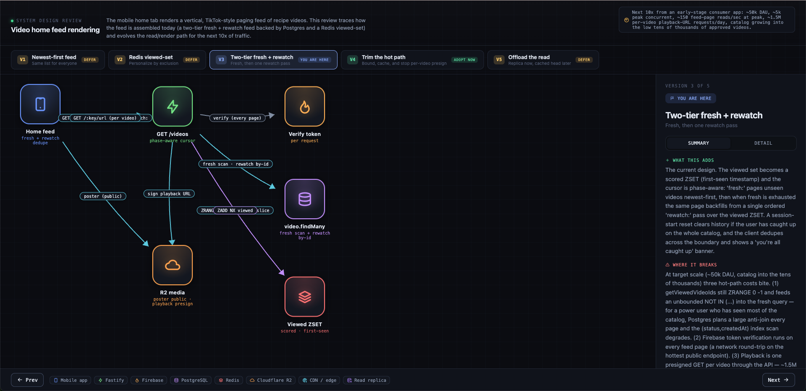

# system-design-review

A Claude Code skill that takes a real flow from your codebase and walks it through a system-design evolution: v1 (naive/current), where it breaks under load, v2 fixes it, where *that* breaks, v3, and so on, grounded entirely in your actual code, not generic advice. It renders as an interactive, version-toggle diagram plus a written report.

## Where this came from

This was inspired by [KodeKloud](https://www.tiktok.com/@kodekloud)'s system design content on TikTok: videos that walk through "here's the naive way to build X, here's exactly where it falls over, here's how you'd evolve it" for well-known systems (Twitter, Uber, etc.).

Watching those made me wonder: what if that same senior-engineer walkthrough existed for *my own app*, using *my own stack*, not a generic case study, but grounded in the actual code, actual database schema, actual services I've wired up? Instead of learning how Twitter's feed theoretically scales, I wanted to know how *my* feed, *my* upload flow, *my* auth actually behaves under 10x load, and what the very next concrete step should be, file by file, service by service.

That's what this skill does: it reads your real flow (entry point to API route to service to DB/cache/storage), reasons honestly about where it breaks at the next realistic scale for *your* stack, and gives version-by-version recommendations customized to your codebase's actual tech choices and unique features, not a textbook answer.

## Usage

Run the skill against a flow that already exists in your codebase (e.g. `signup`, `video upload`, `feed`, `notifications`). See `SKILL.md` for the full process. Output is written to `.claude/design-output/<slug>/` as an interactive HTML diagram (`<slug>.html`) and a written report (`<slug>.md`).
